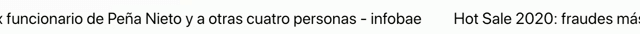

# ticker-lib

> Made with create-react-library

[](https://www.npmjs.com/package/ticker-lib) [](https://standardjs.com)

## Install

```bash
npm install --save ticker-lib
```

## Usage

```jsx
import React, { Component } from 'react'

import { GetTicker } from 'ticker-lib';

import './node_modules/ticker-lib/dist/index.css';

class Example extends Component {
  render() {
    return <MyComponent 
    			tickerObj={tickerObj}
    		/>
  }
}
```

## Notes

```
I use this lib with google news https://newsapi.org/s/google-news-api, they send a json with title, i  just add the title to the ticker, but you can use whatever you want or create your on json, just remember add a node called title.

e.g. 
ticketObj=[
	{title:'Title one'},
	{title:'Title Two'}
]
background is transparent and font will use whatever font you are using on your project
```
Example:

## License

MIT © [](https://github.com/)
